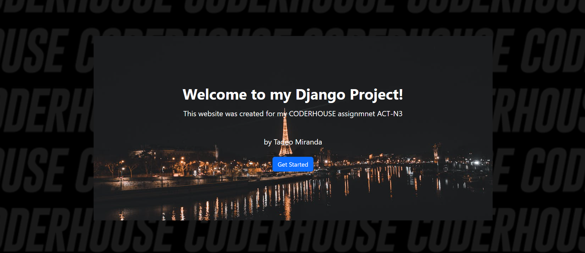
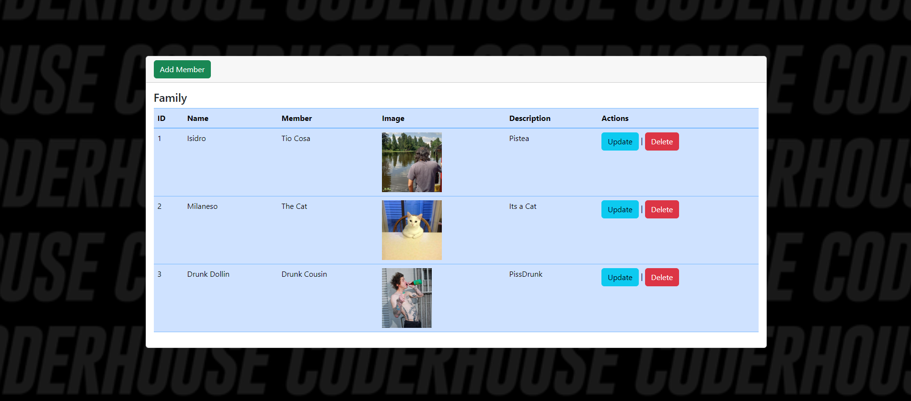
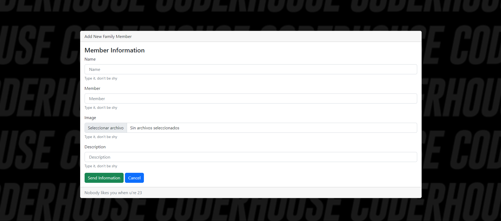

# Django CRUD App Items and Images

This is my "Family Manager web application project", built as part of the CODERHOUSE ACT 3 course by Tadeo Miranda.

**Current Status (Feb 13, 2023):** The user interface, pages, buttons, and other components are still in active development (**|||nvmnd im not going to touch this code again on my life so IT IS WHAT IT IS|||**). The initial START button doesn't yet have functionality. Please feel free to navigate using the navigation bar. You can explore the "Family" section to test the CRUD app.

## Project Overview

You can create, read, update and delate items w title, description, image and that stuff...

1. Main Screen

2. CRUD List

1. CRUD Operations

## Features

- **CRUD Functionality:** The application supports Create, Read, Update, and Delete operations for managing family members' information.
- **Database:** I've integrated a MySQL database (feel free to use another one) to securely store the family members' data.
- **User Interface:** The application uses HTML templates and Bootstrap for a user-friendly and visually appealing interface.
- **Responsive Design:** The frontend is styled with CSS and Bootstrap, ensuring a responsive experience across various devices.

## Installation

To run this application locally, follow these steps:

1. Clone the repository
2. Create virtualenv and pip install -r requirements.txt
3. Make migrations
4. python manage.py runserver
5. GET a Beer and enjoy my project
